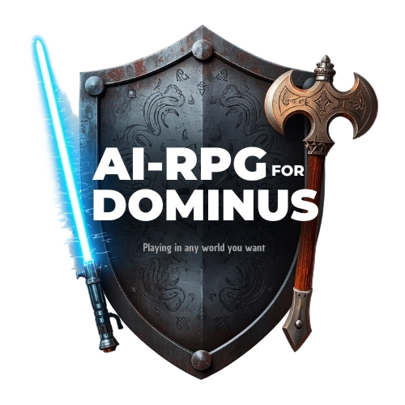

<h1 align="center">
    
</h1>


<div align="center">
    


</div>
<br>
AI-RPG is a revolutionary way to experience tabletop RPGs. It empowers anyone, regardless of coding skill or computer power, to become the Master (or GM) of their own fantasy worlds.

---

# 💻 Key Features:

-    **👥 No Programming Required**: Design your world using simple, intuitive tools.

-    **🤖 AI Players**: The AI fills the role of the players, giving you dynamic, unpredictable stories.

-    **🎮 Instant Start**: The built-in Dominus system is designed for immediate play, eliminating the need to study complex rulebooks before starting.

- **⚡ No high-end computer required**: With an lightweight offline speech-to-text tool, Vosk by using [nerd-dictation](https://github.com/ideasman42/nerd-dictation), [Google's Gemma API](https://ai.google.dev/gemma/docs) for text generation and [Murf AI API](https://murf.ai/api) for the TTS, you can play in almost any capable device of running a python script and listening to audio!

### 📜 What do you need:
- One simple laptop.
- One D6 dice.
- A microphone or just your keyboard.
- The Dominus system ready.
- Some API keys.


## What is the Dominus System?

[](https://youtu.be/OUGHvPqq53w)

### [Watch this video on YouTube](https://youtu.be/OUGHvPqq53w)

## Instalation:
```
    $ python -m venv .venv
    $ source .venv/bin/activate
    $ pip install -r requirements.txt
```

## Usage:

You can either [**use an existing Dominus system**](https://rpgsolobrasil.blogspot.com/) — just search for Dominus in the search bar — from the internet, or just create your own by modifying the **default template**.

Here is the default template with two different translations:

- > 🇧🇷 [Portuguese (Brazil)](https://docs.google.com/document/d/1dpwhswNvg2cgHPJ-7bnlg43MF0mvACDjd4QmrBLjBI4/edit?tab=t.0#heading=h.y1t6y85ts5ut)

- > 🇺🇸 [English](https://docs.google.com/document/d/1hTbKLNOVnKsKhgzSrSI4qT-M2NYfYOBqQjjt_r6j_w4/edit?tab=t.0#heading=h.y1t6y85ts5ut)

> ⚠️ **Warning**: It's still under development and you can't add your own Dominus system automatically yet. But this is a planned feature that is going to be added. But, you can still add your own system if you understand how the "settings" folder works.


### ```📂 /src/settings```:

This is where you are going to add all the information from your system so the AI will use it to create your plot and characters.

# 1. Plot creation:
Once the ``settings`` folder is done containing all required files, you can run the ``plot_creator.py``.

```
    $ python plot_creator.py 
```

You are going to be asked for numbers, this is where you need to roll D6 dices (you are using the plot section under your Dominus system).

# 2. Player creation:

Once the player is already created, you are going to roll one dice to roll for the ``archetype`` for your character in your Dominus system, and another one for the AI player's initiative. 

Run this following line in your terminal and use the values you got. Describe your character and mention which archetype it is, and the AI will automatically attach to it.

```
    $ python player_creator.py
```


# 3. Go play!

```
    $ python main.py
```

Just tell the character's filename (without specifying the path), it defaults to ``src/characters`` for example ``john_doe.txt`` and now you just need to describe what happened.

